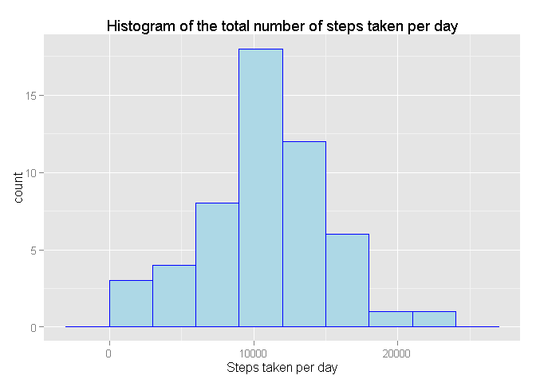
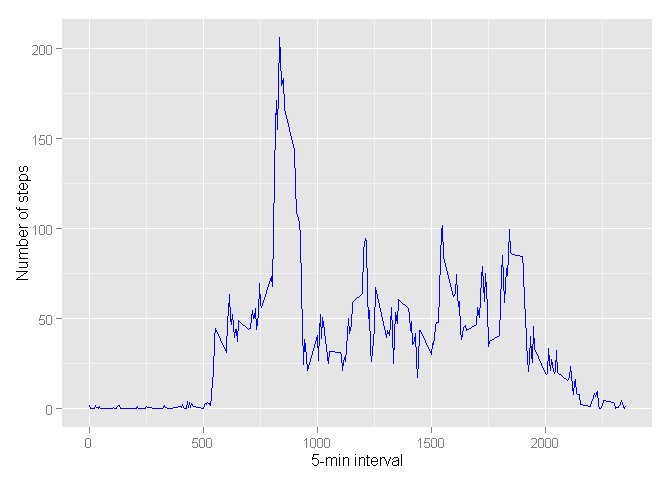
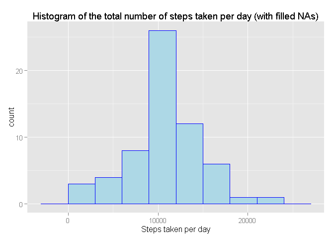
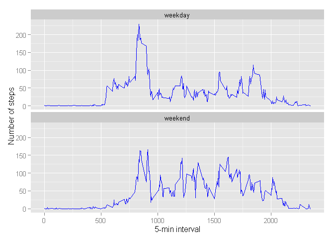

# Reproducible Research: Peer Assessment 1

##Loading and preprocessing the data


```r
library(dplyr)
library(ggplot2)
library(xtable)

fileUrl <- "https://d396qusza40orc.cloudfront.net/repdata%2Fdata%2Factivity.zip"

if (!file.exists("activity.zip")) {
        cat("Downloading...")
        download.file(fileUrl, destfile = "./activity.zip")
}

data_initial <- read.csv(unz("./activity.zip", "activity.csv"),
        sep=",", 
        col.names = c("Steps", "Date", "Interval"), 
        na.strings = "NA")
```

##What is mean total number of steps taken per day?  

Let's calculate the total number of steps taken per day:


```r
data_clear <- na.omit(data_initial)
daily_data <- data_clear %>% group_by(Date) %>% summarise(Total = sum(Steps))
```

Here is the head of dataframe:


```r
xt <- xtable(head(daily_data))
print(xt, type = "html")
```

<!-- html table generated in R 3.1.2 by xtable 1.7-4 package -->
<!-- Sun Apr 19 22:36:27 2015 -->
<table border=1>
<tr> <th>  </th> <th> Date </th> <th> Total </th>  </tr>
  <tr> <td align="right"> 1 </td> <td> 2012-10-02 </td> <td align="right"> 126 </td> </tr>
  <tr> <td align="right"> 2 </td> <td> 2012-10-03 </td> <td align="right"> 11352 </td> </tr>
  <tr> <td align="right"> 3 </td> <td> 2012-10-04 </td> <td align="right"> 12116 </td> </tr>
  <tr> <td align="right"> 4 </td> <td> 2012-10-05 </td> <td align="right"> 13294 </td> </tr>
  <tr> <td align="right"> 5 </td> <td> 2012-10-06 </td> <td align="right"> 15420 </td> </tr>
  <tr> <td align="right"> 6 </td> <td> 2012-10-07 </td> <td align="right"> 11015 </td> </tr>
   </table>

Histogram of the total number of steps taken per day:


```r
hist <- ggplot(daily_data, aes(Total))
hist + geom_histogram(color = "blue", fill = "lightblue", binwidth = 3000) +
        labs(title="Histogram of the total number of steps taken per day", x = "Steps taken per day")
```

 

Then calculate and report the mean and median of the total number of steps taken per day:


```r
mean_steps_daily <- mean(daily_data$Total)
median_steps_daily <- median(daily_data$Total)
```


**Mean** of the total number of steps taken per day = 1.0766189\times 10^{4}   
**Median** of the total number of steps taken per day = 10765

##What is the average daily activity pattern?

Let's make a time series plot of the 5-minute interval (x-axis) and the average number of steps taken, averaged across all days (y-axis):

```r
interval_data <- data_clear %>% group_by(Interval) %>% summarise(Average = mean(Steps))

g <- ggplot(interval_data, aes(Interval, Average))
g + geom_line(color = "blue") + xlab("5-min interval") + ylab("Number of steps")
```

 

Let's find which 5-minute interval, on average across all the days in the dataset, contains the maximum number of steps:


```r
max_int <- filter(interval_data, Average == max(Average))
```

This interval number is **835** and its maximum number of steps is **206.2**

##Imputing missing values

Let's calculate and report the total number of missing values in the dataset (i.e. the total number of rows with NAs):


```r
summary(data_initial)
```

```
##      Steps                Date          Interval     
##  Min.   :  0.00   2012-10-01:  288   Min.   :   0.0  
##  1st Qu.:  0.00   2012-10-02:  288   1st Qu.: 588.8  
##  Median :  0.00   2012-10-03:  288   Median :1177.5  
##  Mean   : 37.38   2012-10-04:  288   Mean   :1177.5  
##  3rd Qu.: 12.00   2012-10-05:  288   3rd Qu.:1766.2  
##  Max.   :806.00   2012-10-06:  288   Max.   :2355.0  
##  NA's   :2304     (Other)   :15840
```

So, total number of missing values in the dataset is **2304**.

As a strategy for filling in all of the missing values in the dataset I'm using *rounded mean for that 5-minute interval*.

Creating a new dataset that is equal to the original dataset but with the missing data filled in:


```r
na_data <- filter(data_initial, is.na(Steps))
good_data <- filter(data_initial, !is.na(Steps))

interval_data$Average <- round(interval_data$Average, 0)
filled_data <- left_join(na_data[2:3], interval_data, by = "Interval")
colnames(filled_data) <- c("Date", "Interval", "Steps")

filled_data <- filled_data[, c("Steps", "Date", "Interval")]

fixed_data <- bind_rows(good_data, filled_data) %>% arrange(Date, Interval)
```

Here is the head of the new dataset:

```r
xt2 <- xtable(head(fixed_data))
print(xt2, type = "html")
```

<!-- html table generated in R 3.1.2 by xtable 1.7-4 package -->
<!-- Sun Apr 19 22:36:27 2015 -->
<table border=1>
<tr> <th>  </th> <th> Steps </th> <th> Date </th> <th> Interval </th>  </tr>
  <tr> <td align="right"> 1 </td> <td align="right"> 2.00 </td> <td> 2012-10-01 </td> <td align="right">   0 </td> </tr>
  <tr> <td align="right"> 2 </td> <td align="right"> 0.00 </td> <td> 2012-10-01 </td> <td align="right">   5 </td> </tr>
  <tr> <td align="right"> 3 </td> <td align="right"> 0.00 </td> <td> 2012-10-01 </td> <td align="right">  10 </td> </tr>
  <tr> <td align="right"> 4 </td> <td align="right"> 0.00 </td> <td> 2012-10-01 </td> <td align="right">  15 </td> </tr>
  <tr> <td align="right"> 5 </td> <td align="right"> 0.00 </td> <td> 2012-10-01 </td> <td align="right">  20 </td> </tr>
  <tr> <td align="right"> 6 </td> <td align="right"> 2.00 </td> <td> 2012-10-01 </td> <td align="right">  25 </td> </tr>
   </table>

Let's depict histogram of the total number of steps taken per day using filled data:


```r
daily_data_f <- fixed_data %>% group_by(Date) %>% summarise(Total = sum(Steps))
hist <- ggplot(daily_data_f, aes(Total))
hist + geom_histogram(color = "blue", fill = "lightblue", binwidth = 3000) +
        labs(title="Histogram of the total number of steps taken per day (with filled NAs)", x = "Steps taken per day")
```

 

Then calculate and report the mean and median of the total number of steps taken per day:


```r
mean_steps_daily_f <- mean(daily_data_f$Total)
median_steps_daily_f <- median(daily_data_f$Total)
```

**Mean** of the total number of steps taken per day = 1.0765639\times 10^{4}   
**Median** of the total number of steps taken per day = 1.0762\times 10^{4}

Now we can find out do these values differ from the estimates from the first part of the assignment:

Mean (without NAs) = **10766.19** vs. Mean (with filled NAs) = **10765.64**  
Median (without NAs) = **10765** vs. Median (with filled NAs) = **10762**

As we can see, with selected filled strategy (rounded mean for 5-minute interval) mean values approximately the same, while median with filled NAs is a bit lower.

##Are there differences in activity patterns between weekdays and weekends?

Creating new factor variable in the dataset with two levels - "weekday" and "weekend" indicating whether a given date is a weekday or weekend day:


```r
fixed_data$Date <- as.Date(fixed_data$Date)
fixed_data <- mutate(fixed_data, DayOfWeek = ifelse (weekdays(Date) == "Saturday" | weekdays(Date) == "Sunday", "weekend", "weekday"))
```

Here is the head of the updated dataset:

```r
xt3 <- xtable(head(fixed_data))
print(xt3, type = "html")
```

<!-- html table generated in R 3.1.2 by xtable 1.7-4 package -->
<!-- Sun Apr 19 22:36:28 2015 -->
<table border=1>
<tr> <th>  </th> <th> Steps </th> <th> Date </th> <th> Interval </th> <th> DayOfWeek </th>  </tr>
  <tr> <td align="right"> 1 </td> <td align="right"> 2.00 </td> <td align="right"> 15614.00 </td> <td align="right">   0 </td> <td> weekday </td> </tr>
  <tr> <td align="right"> 2 </td> <td align="right"> 0.00 </td> <td align="right"> 15614.00 </td> <td align="right">   5 </td> <td> weekday </td> </tr>
  <tr> <td align="right"> 3 </td> <td align="right"> 0.00 </td> <td align="right"> 15614.00 </td> <td align="right">  10 </td> <td> weekday </td> </tr>
  <tr> <td align="right"> 4 </td> <td align="right"> 0.00 </td> <td align="right"> 15614.00 </td> <td align="right">  15 </td> <td> weekday </td> </tr>
  <tr> <td align="right"> 5 </td> <td align="right"> 0.00 </td> <td align="right"> 15614.00 </td> <td align="right">  20 </td> <td> weekday </td> </tr>
  <tr> <td align="right"> 6 </td> <td align="right"> 2.00 </td> <td align="right"> 15614.00 </td> <td align="right">  25 </td> <td> weekday </td> </tr>
   </table>

Now let's make a panel plot containing a time series plot of the 5-minute interval (x-axis) and the average number of steps taken, averaged across all weekday days or weekend days (y-axis):

```r
daily_data <- fixed_data %>% group_by(DayOfWeek, Interval) %>% summarise(Average = mean(Steps))
g3 <- ggplot(daily_data, aes(Interval, Average))
g3 + geom_line(color = "blue") + facet_wrap(~ DayOfWeek, nrow=2, ncol=1) + 
        xlab("5-min interval") + ylab("Number of steps")
```

 

Thus, there are differences in activity patterns between weekdays and weekends. During weekdays there is a spike around interval 800 with 200+ steps during 5 mins (must be when people are going to workplaces), then values decreases  (during workday) and there is a spike around interval 1750 with 80+ steps when most of people leave their workplaces.  
During weekends we observe another picture: daily activity pattern more common (doesn't contain so high spikes as during weekdays). This is logical as during weekends people have more activity during mid of the day and that's why activity pattern is smoothed (without high spikes) if compare with weekday pattern.
